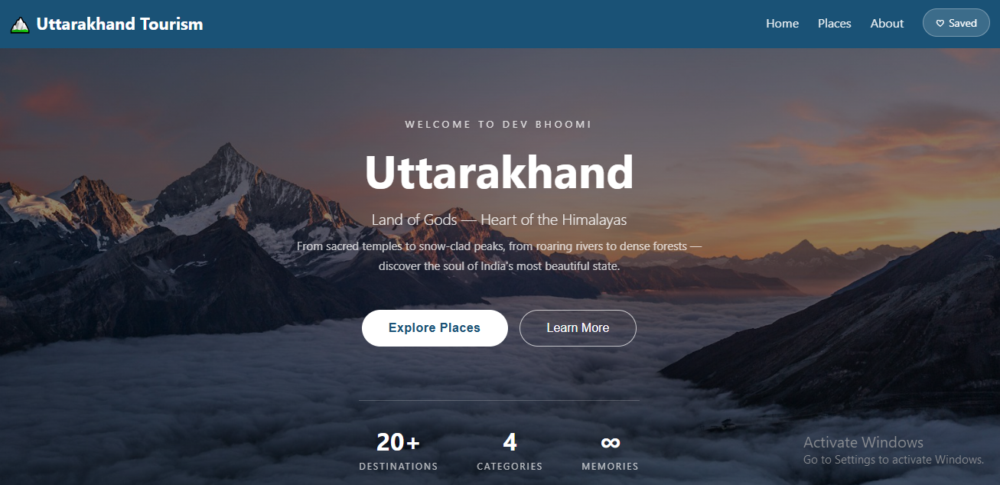
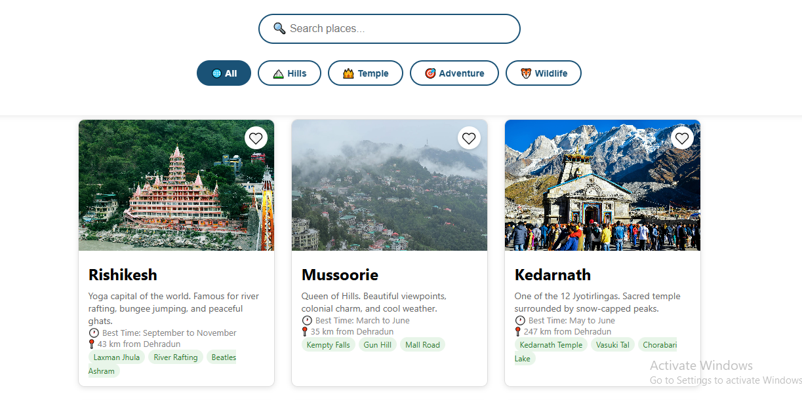

# 🏔️ Uttarakhand Tourism

A tourism web app built with React.js + Vite featuring 20+ destinations across Uttarakhand — Dev Bhoomi, Land of Gods.

## 🔗 Live Demo
[👉 Click here to view the live site](https://shaliniuniyal90.github.io/Uttarakhand-Tourism/)

## 📸 Preview

## ✨ Features
- 🗺️ 20+ destinations across Garhwal & Kumaon regions
- 🔍 Filter by category — Mountains, Temples, Adventure, Wildlife
- 🌤️ Live weather using OpenWeather API
- ❤️ Save favourite places
- 🏨 Hotel & restaurant info for each destination
- 📍 Detailed place pages

## 🛠️ Tech Stack
- React.js 19
- Vite 8
- React Router DOM
- OpenWeather API

## 👩‍💻 Developer
Made with ❤️ by **Shalini Uniyal**
